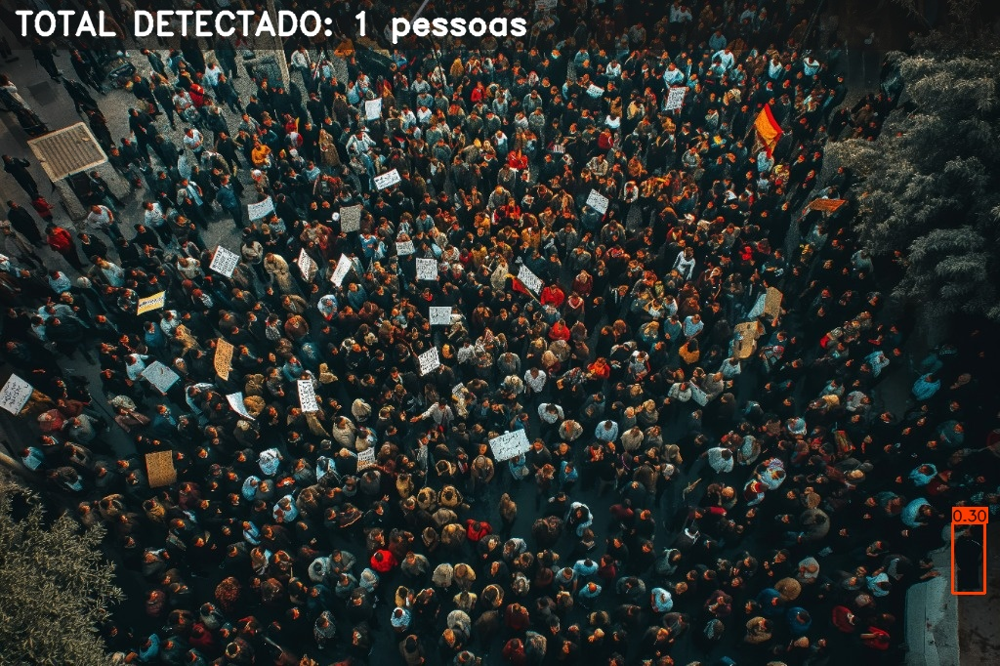
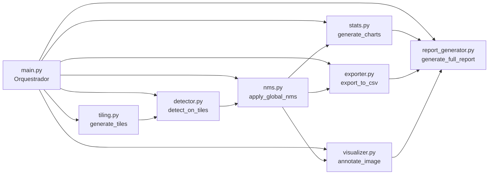

# 🚁 Agente de Contagem de Público em Imagens de Drones
### Sistema de Visão Computacional com YOLOv8 · Sliding Window Tiling · NMS Global · Relatórios Técnicos Automatizados

<p align="center">
  
</p>

<p align="center">
  <a href="https://github.com/ErisonBarros/agent_contagem_publico"></a>
  <a href="https://python.org"></a>
  <a href="https://ultralytics.com"></a>
  <a href="https://opencv.org"></a>
  <a href="https://opensource.org/licenses/MIT"></a>
  <a href="https://colab.research.google.com/"></a>
  <a href="https://linktr.ee/ProfErisonBarros"></a>
</p>

---

## 📋 Visão Geral

Este repositório implementa um **pipeline completo e profissional de Visão Computacional** para detectar e contar pessoas em **mosaicos de imagens aéreas de alta resolução** capturadas por drones (UAVs). O sistema foi arquitetado especificamente para superar os desafios de escala, densidade irregular e oclusão inerentes à fotografia aérea de grandes eventos.

### 🎯 O Problema

Imagens de drones em eventos públicos podem chegar a **dezenas de milhares de pixels** de largura e altura. Ao alimentar diretamente detectores como o YOLOv8 com essas imagens, o modelo é forçado a redimensioná-las para 640×640 pixels — o que **esmaga, distorce e torna invisíveis** pedestres que, na escala original, já são pequenos. O resultado é uma contagem imprecisa e inutilizável.

### 💡 A Solução: Pipeline em 5 Etapas

```
[Mosaico .jpg de Alta Resolução]
         │
         ▼
┌─────────────────────────────────┐
│  ETAPA 1 · tiling.py            │
│  Sliding Window Tiling          │
│  → Gera N tiles sobrepostos     │
└──────────────┬──────────────────┘
               │  Lista de (tile_imagem, x_offset, y_offset)
               ▼
┌─────────────────────────────────┐
│  ETAPA 2 · detector.py          │
│  Inferência YOLOv8 por Tile     │
│  → Detecta apenas classe=PESSOA │
└──────────────┬──────────────────┘
               │  Detecções com coordenadas LOCAIS
               ▼
┌─────────────────────────────────┐
│  ETAPA 3 · nms.py               │
│  Remapeamento + NMS Global      │
│  → Coordenadas globais únicas   │
└──────────────┬──────────────────┘
               │  Detecções FINAIS sem duplicatas
               ▼
┌────────────────────────────────────────────────────┐
│  ETAPA 4 · visualizer.py  +  stats.py  +  exporter │
│  Anotação Visual · Gráficos · Exportação CSV        │
└──────────────┬─────────────────────────────────────┘
               │
               ▼
┌─────────────────────────────────┐
│  ETAPA 5 · report_generator.py  │
│  Relatório Técnico (Markdown)   │
└─────────────────────────────────┘
```

---

## 🗂️ Estrutura de Pastas e Arquivos

```
agent_contagem_publico/
│
├── 📄 README.md                     ← Este documento
│
├── 🧠 contexto/                     ← Núcleo principal da aplicação Python
│   │
│   ├── 🚀 main.py                   ← Orquestrador CLI do pipeline completo
│   ├── 🔲 tiling.py                 ← Sliding Window Tiling (fatiamento)
│   ├── 🔍 detector.py               ← Detecção YOLOv8 por tile
│   ├── 🧮 nms.py                    ← NMS Global (eliminação de duplicatas)
│   ├── 🎨 visualizer.py             ← Anotação visual da imagem final
│   ├── 📊 stats.py                  ← Geração de Heatmap e Histograma
│   ├── 💾 exporter.py               ← Exportação de detecções para CSV
│   ├── 📝 report_generator.py       ← Gerador automático de Relatório Técnico
│   ├── 🏗️  build_notebook.py         ← Construtor de Notebooks Jupyter/Colab
│   ├── ✅ test_phase1.py             ← Testes unitários da Fase 1
│   │
│   ├── 📁 Prompts/                  ← Prompts de IA usados na construção
│   │
│   ├── 📁 .planning/                ← Documentação de planejamento (GSD)
│   │   ├── PROJECT.md               ← Especificação completa do projeto
│   │   └── ...                      ← Roadmap e planos de fase detalhados
│   │
│   ├── 📄 README.md                 ← Documentação técnica detalhada dos módulos
│   ├── 📄 claude.md                 ← Referência técnica gerada durante o desenvolvimento
│   ├── 📄 contexto.md               ← Contexto de negócio e fundamentos tecnológicos
│   ├── 📄 diagramas.md              ← Diagramas Mermaid do sistema
│   └── 📄 relatorio_tecnico.md      ← Template do relatório gerado automaticamente
│
├── 🧪 .testes/                      ← Testes, validações e notebooks Colab
│   ├── Aplicacao_Contagem_Drones.ipynb  ← Notebook consolidado com pipeline completo
│   ├── Simulacao_Fase1_Contagem.ipynb   ← Simulação e validação da Fase 1
│   └── Teste_Fase_1.md                  ← Relatório da simulação inicial
│
├── 🤖 .agents/                      ← Definições do agente de IA
│   └── agent.md                     ← Diretrizes e regras de comportamento da IA
│
└── ⚙️  .cmd_GSD/                     ← Comandos e utilitários do workflow GSD
```

---

## 📄 Documentação Detalhada dos Arquivos

### 🐍 Módulos Python — `contexto/`

---

#### `main.py` — Orquestrador Principal (CLI)
**Função:** Script de entrada que integra e coordena todo o pipeline end-to-end.

Parâmetros aceitos via linha de comando:

| Argumento | Padrão | Descrição |
|-----------|--------|-----------|
| `--image` | *(obrigatório)* | Caminho para o mosaico de entrada (`.jpg`, `.png`, `.tif`) |
| `--conf`  | `0.3` | Limiar de confiança mínima do YOLOv8 (0.0 a 1.0) |
| `--iou`   | `0.45` | Limiar IoU para o NMS (controla sobreposição tolerada) |
| `--tile`  | `1280` | Tamanho dos tiles em pixels (quadrado) |
| `--overlap` | `0.2` | Porcentagem de sobreposição entre tiles adjacentes |

**Uso rápido:**
```bash
python contexto/main.py --image "imagem_evento.jpg" --conf 0.3 --tile 1280
```

---

#### `tiling.py` — Sliding Window Tiling
**Função:** Fatiar o mosaico em tiles menores com sobreposição configurável.

**Como funciona:**
- Calcula automaticamente o `stride` (passo) com base no tamanho e overlap: `stride = tile_size * (1 - overlap)`.
- Itera sobre colunas e linhas do mosaico gerando tiles que incluem as bordas.
- Retorna uma lista de tuplas `(tile_imagem, x_offset, y_offset)` para rastreamento de posição global.

**Exemplo:**
```python
from tiling import generate_tiles
tiles = generate_tiles(mosaic_image, tile_size=1280, overlap=0.2)
# → Retorna lista de (tile_array, x_inicial, y_inicial)
```

---

#### `detector.py` — Inferência YOLOv8 por Tile
**Função:** Executar o modelo YOLOv8 em cada tile e retornar detecções da classe "pessoa".

**Detalhes técnicos:**
- Carrega o modelo `yolov8n.pt` (ou modelo customizado via parâmetro).
- Filtra exclusivamente a **classe 0** (pessoa/pedestre) do COCO dataset.
- Aplica o limiar de confiança configurado (`conf`).
- Retorna bounding boxes no formato `[x1, y1, x2, y2, confiança]` em coordenadas **locais do tile**.

---

#### `nms.py` — NMS Global (Non-Maximum Suppression)
**Função:** Eliminar detecções duplicadas geradas nas zonas de sobreposição entre tiles adjacentes.

**Processo:**
1. Recebe todas as detecções com coordenadas locais e os offsets de cada tile.
2. **Remapeia** as coordenadas locais para as coordenadas globais do mosaico: `x_global = x_local + x_offset`.
3. Executa `cv2.dnn.NMSBoxes()` em **todas as detecções globais simultaneamente**.
4. Retorna apenas as detecções sobreviventes — garantindo que cada pessoa seja contada **uma única vez**.

---

#### `visualizer.py` — Anotação Visual
**Função:** Desenhar bounding boxes, etiquetas de confiança e o contador total sobre a imagem final.

**Saída:** Arquivo `output_crowd.jpg` com todas as marcações visuais sobrepostas.

---

#### `stats.py` — Estatísticas e Gráficos Analíticos
**Função:** Gerar gráficos que evidenciam a qualidade e a distribuição espacial das detecções.

Dois gráficos são gerados:

| Gráfico | Arquivo | Descrição |
|---------|---------|-----------|
| Histograma de Confiança | `conf_histogram.png` | Distribuição estatística do nível de certeza do modelo |
| Mapa de Calor (Heatmap) | `density_heatmap.png` | Zonas de maior aglomeração de pessoas no mosaico |

```python
from stats import generate_confidence_histogram, generate_density_heatmap
generate_confidence_histogram(final_detections)
generate_density_heatmap(mosaic_shape, final_detections)
```

---

#### `exporter.py` — Exportação para CSV
**Função:** Exportar os dados brutos de cada detecção em formato tabular auditável.

**Arquivo gerado:** `detections.csv`

**Colunas:**

| Coluna | Tipo | Descrição |
|--------|------|-----------|
| `x1, y1` | int | Canto superior esquerdo da bounding box (global) |
| `x2, y2` | int | Canto inferior direito da bounding box (global) |
| `confiança` | float | Score de confiança do YOLOv8 (0.0 a 1.0) |
| `centro_x, centro_y` | float | Ponto central da pessoa detectada |

---

#### `report_generator.py` — Relatório Técnico Automatizado
**Função:** Consolidar todos os resultados em um documento Markdown profissional.

**Arquivo gerado:** `relatorio_tecnico.md`

**Estrutura do Relatório:**
1. **Identificação** — Nome do processo, perito responsável e data.
2. **Resumo Executivo** — Contagem total de pessoas detectadas.
3. **Metodologia Computacional** — Parâmetros utilizados (conf, iou, tile_size).
4. **Resultados Visuais** — Imagem processada com anotações.
5. **Análise Estatística** — Histograma de confiança e Mapa de Calor.
6. **Dados Brutos** — Referência ao CSV com todas as detecções.
7. **Conclusão Técnica** — Texto gerado automaticamente com os achados.

---

#### `build_notebook.py` — Construtor de Notebooks
**Função:** Converter os módulos Python do pipeline em um Notebook Jupyter/Google Colab auto-contido.

- Lê os módulos `.py` do pipeline na ordem correta.
- Gera um arquivo `.ipynb` com células organizadas e comentadas.
- Facilita execução em ambientes de nuvem sem instalação local.

---

#### `test_phase1.py` — Testes Unitários da Fase 1
**Função:** Bateria de testes isolados para validar `tiling.py` e `detector.py`.

Cenários testados:
- ✅ Geração de tiles em imagens sintéticas (verificação de dimensões).
- ✅ Warm-up do modelo YOLOv8 (carregamento sem erros).
- ✅ Filtragem correta de falsos positivos (apenas classe 0 retorna).

---

### 📝 Documentação Markdown — `contexto/*.md`

---

#### `README.md` — Documentação Técnica dos Módulos
Referência técnica detalhada de cada módulo Python: funções, parâmetros, exemplos de uso e notas de implementação. Destinado a desenvolvedores que desejam estender ou integrar o sistema.

---

#### `claude.md` — Referência de Desenvolvimento com IA
Documento de contexto técnico extenso gerado durante o desenvolvimento assistido por IA. Contém:
- Arquitetura completa dos módulos e suas interfaces.
- Matemática do Sliding Window Tiling (derivação das fórmulas de stride).
- Fundamentos do YOLOv8 aplicado a perspectiva aérea.
- Guia completo de calibração dos hiperparâmetros.
- Trechos de código de referência e *code snippets*.

---

#### `contexto.md` — Contexto de Negócio e Tecnologia
Documento orientado para stakeholders e clientes não-técnicos. Explica:
- O desafio operacional de contar público em imagens de drones.
- Por que o redimensionamento direto falha matematicamente.
- A solução de tiling como abordagem robusta, precisa e auditável.
- Casos de uso: perícias judiciais, segurança pública, planejamento urbano, análise de eventos.

---

#### `diagramas.md` — Diagramas Técnicos (Mermaid)
Contém os diagramas do sistema em formato Mermaid (renderizáveis no GitHub):
- **Diagrama de Fluxo do Pipeline:** Do mosaico de entrada ao relatório final.
- **Diagrama de Classes:** Relação entre os módulos Python e suas dependências.
- **Diagrama do Problema NMS:** Visualização das zonas de overlap e como o NMS resolve duplicatas.

---

#### `relatorio_tecnico.md` — Template do Relatório Gerado
Exemplo real de saída do `report_generator.py`. Serve como:
- Referência de formato e estrutura para clientes.
- Documento de validação da qualidade do sistema.
- Template base para customizações de relatório.

---

### 🧪 Pasta `.testes/`

---

#### `Aplicacao_Contagem_Drones.ipynb` — Notebook Principal Consolidado
Notebook Jupyter/Google Colab com o pipeline **completo e integrado**. Contém todas as células necessárias para:
- Instalar dependências no Colab.
- Carregar uma imagem de multidão.
- Executar o pipeline completo (tiling → detecção → NMS → relatório).
- Visualizar os resultados inline no notebook.

**Como usar no Google Colab:**
1. Faça upload do notebook para o Google Drive.
2. Abra com Google Colab.
3. Execute `Runtime > Run All`.

---

#### `Simulacao_Fase1_Contagem.ipynb` — Simulação da Fase 1
Notebook de simulação e testes da primeira fase (Tiling + Detecção), usado para validar os módulos individualmente antes da integração completa.

---

#### `Teste_Fase_1.md` — Relatório da Simulação Inicial
Relatório documentando os resultados da validação da Fase 1:
- Teste de fatiamento com imagem sintética de 3840×2160.
- Warm-up do modelo YOLOv8.
- Verificação de ausência de falsos positivos em imagem geométrica.
- **Resultado:** ✅ APROVADO — pipeline base funcionando corretamente.

---

## ⚙️ Instalação e Configuração

### Pré-requisitos

- Python 3.9 ou superior
- pip 21+

### Instalar dependências

```bash
pip install ultralytics opencv-python-headless matplotlib seaborn numpy pandas
```

> **Nota:** O modelo `yolov8n.pt` é baixado automaticamente pelo Ultralytics na primeira execução. Para uso offline, faça o download prévio em [ultralytics.com](https://ultralytics.com).

---

## 🚀 Como Executar

### Via CLI (Terminal Local)

```bash
# Processamento com parâmetros padrão
python contexto/main.py --image "caminho/para/mosaico.jpg"

# Processamento calibrado para eventos densos
python contexto/main.py --image "evento.jpg" --conf 0.4 --iou 0.45 --tile 1280 --overlap 0.2
```

### Via Google Colab

1. Abra o notebook `.testes/Aplicacao_Contagem_Drones.ipynb` no Google Colab.
2. Faça upload da imagem do mosaico quando solicitado.
3. Execute todas as células em sequência.
4. Os resultados são exibidos inline e salvos na sessão do Colab.

---

## 📊 Saídas Geradas pelo Sistema

| Arquivo | Tipo | Descrição |
|---------|------|-----------|
| `output_crowd.jpg` | Imagem | Mosaico anotado com bounding boxes e contagem total |
| `detections.csv` | Tabela | Dados brutos: coordenadas + confiança de cada pessoa |
| `conf_histogram.png` | Gráfico | Histograma da distribuição de confiança do modelo |
| `density_heatmap.png` | Gráfico | Mapa de calor espacial das aglomerações |
| `relatorio_tecnico.md` | Documento | Relatório técnico completo em Markdown |

---

## 🎛️ Calibração dos Hiperparâmetros

| Parâmetro | Valor Recomendado | Impacto |
|-----------|-------------------|---------|
| `conf` | 0.3 – 0.5 | Mais alto = menos falsos positivos, mais falsos negativos |
| `iou` | 0.4 – 0.5 | Mais alto = mais detecções únicas (menos agressivo no NMS) |
| `tile_size` | 640 ou 1280 | Maior = mais detalhe, mais lento |
| `overlap` | 0.2 – 0.3 | Maior = mais redundância, mais seguro nas bordas |

> **Dica:** Para multidões muito densas, reduza `conf` para 0.25 e aumente `overlap` para 0.3.

---

## 📐 Fundamento Matemático

### Sliding Window Tiling

Dado um mosaico de dimensões `W × H` e um tile de tamanho `T` com sobreposição `p`:

```
stride  = T × (1 - p)
n_cols  = ceil((W - T) / stride) + 1
n_rows  = ceil((H - T) / stride) + 1
n_tiles = n_cols × n_rows
```

Para uma imagem **4K (3840×2160)** com tile=1280 e overlap=0.2:
- stride = 1024 pixels
- n_cols = 4, n_rows = 3
- **Total: ~12 tiles** processados em paralelo

### NMS Global (IoU)

O *Intersection over Union* entre duas bounding boxes **A** e **B**:

```
IoU = Área(A ∩ B) / Área(A ∪ B)
```

Se `IoU > threshold`, a detecção com **menor confiança** é suprimida — garantindo a unicidade de cada contagem.

---

## 🏗️ Arquitetura de Classes



---

## 🤝 Como Contribuir

1. Faça um **fork** do repositório.
2. Crie um branch para sua feature: `git checkout -b feature/minha-melhoria`.
3. Commit suas mudanças: `git commit -m 'feat: adiciona suporte a imagens GeoTIFF'`.
4. Push para o branch: `git push origin feature/minha-melhoria`.
5. Abra um **Pull Request** descrevendo a melhoria.

### Melhorias Futuras Sugeridas

- [ ] Suporte nativo a **GeoTIFF** com preservação de coordenadas geográficas (EPSG).
- [ ] Treinamento customizado do YOLOv8 em dataset de pedestres aéreos (VisDrone, CARPK).
- [ ] Interface web (Streamlit/Gradio) para uso sem linha de comando.
- [ ] Exportação do relatório em **PDF** via `weasyprint` ou `reportlab`.
- [ ] Processamento de **vídeos** de drone (frame-a-frame).

---

## 📜 Licença

Este projeto está licenciado sob a **Licença MIT** — veja o arquivo [LICENSE](LICENSE) para detalhes.

---

## 👨‍💻 Autor

**Erison Barros**  
[](https://github.com/ErisonBarros)
[](https://orcid.org/0000-0003-4879-6880)
[](https://linktr.ee/ProfErisonBarros)

Desenvolvido como ferramenta de suporte à **perícia cartográfica e análise de multidões em imagens aéreas**.

*Desenvolvido com assistência da IA Google Antigravity / PeritoGeo AI.*

---

<p align="center">
  <strong>⭐ Se este projeto foi útil, considere dar uma estrela no GitHub! ⭐</strong>
</p>
