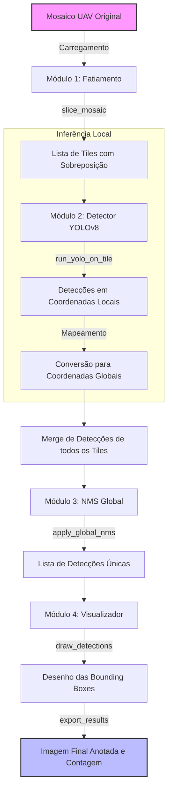
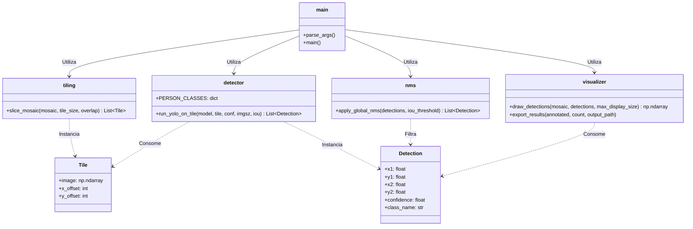
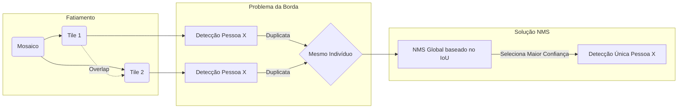

# Diagramas de Fluxo e Arquitetura - Contagem de Público com YOLOv8

Abaixo estão os diagramas representando o funcionamento e a arquitetura do pipeline de detecção e contagem de multidões em mosaicos de drones descrito no documento `claude.md`.

## 1. Fluxo de Processamento Principal (Pipeline)

Este diagrama detalha o passo a passo da execução principal (do `main.py`), mostrando a transformação dos dados desde a entrada do mosaico até a exportação da imagem com a contagem final.

## 2. Estrutura de Módulos e Classes

Este diagrama de classes ilustra como o código está organizado e quais estruturas de dados (como `Tile` e `Detection`) conectam as diferentes etapas.

## 3. Lógica da Janela Deslizante e NMS (Sliding Window Tiling)

Este diagrama explica de forma conceitual como os tiles são gerados com `overlap` (sobreposição) e por que o NMS (Non-Maximum Suppression) é necessário nas bordas.

