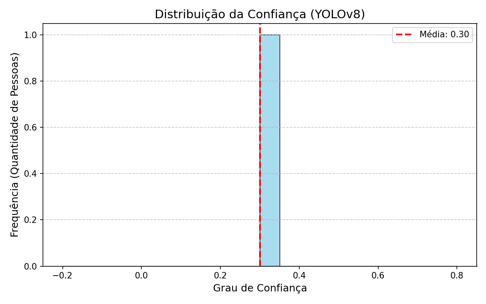
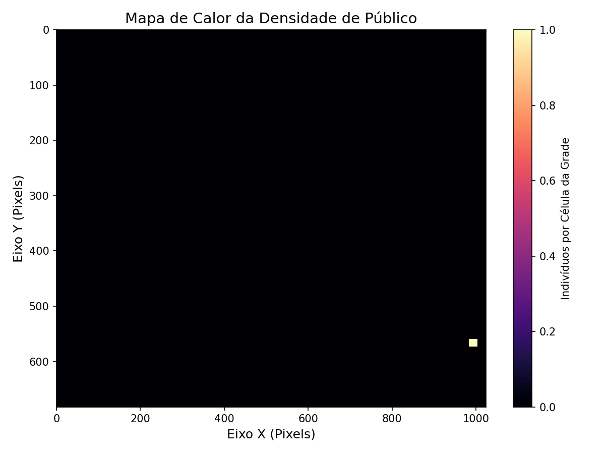

# Relatório Técnico - Contagem Analítica de Público

**Data de Geração:** 01/05/2026 03:51:18
**Processo/Evento:** Inspeção Aérea de Área Pública
**Analista/Perito:** PeritoGeo AI

---

## 1. Resumo da Operação

A análise foi realizada através de segmentação da imagem (*tiling*) e inferência por inteligência artificial (Modelo YOLOv8).

- **Resolução da Imagem Analisada:** 1024x682 px
- **Limiares de Qualidade (Parâmetros):**
  - Confiança Mínima (*Confidence Threshold*): 0.3
  - Supressão Não Máxima (*Global IoU*): 0.5

### 🎯 TOTAL DETECTADO: 1 indivíduos

---

## 2. Resultado Visual da Detecção

Abaixo encontra-se o mosaico processado com as caixas delimitadoras (*bounding boxes*) desenhadas sobre cada indivíduo detectado.

---

## 3. Análise Estatística e Computacional

Os gráficos a seguir comprovam a acurácia do modelo e demonstram a densidade posicional do público na cena mapeada.

### Distribuição de Confiança (Accuracy)
O histograma reflete a certeza matemática do algoritmo em cada detecção.

### Mapa de Calor da Densidade (Heatmap)
O mapa de calor ilustra as regiões com maior concentração de pessoas.

---

## 4. Conclusão e Dados Brutos

O algoritmo rodou com sucesso sem gerar redundâncias de borda (aplicado Filtro NMS Global).
Os dados brutos com as coordenadas de todos os indivíduos detectados foram salvos e podem ser auditados no arquivo:
📂 `detections.csv`

*Relatório gerado automaticamente pelo Agente de Contagem de Público.*
